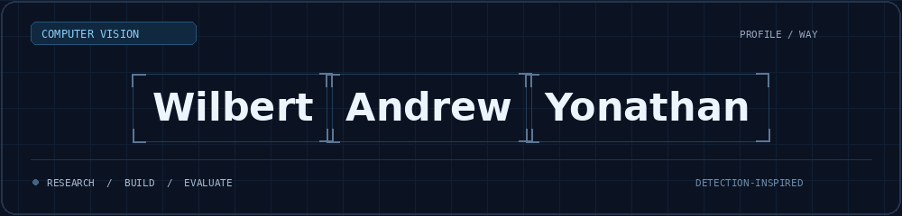

  

  

  <strong>Fourth-year AI Engineering student · Xiamen University Malaysia</strong> 
  Building practical AI applications through research and engineering.

  
  
  
  

## About me

I build **computer vision pipelines and interactive AI applications** using Python, PyTorch, OpenCV, and YOLO. My projects focus on lightweight model architectures, object detection, and visual defect inspection with retrieval-augmented generation (RAG).

I work across dataset preparation, model development, training, evaluation, and application deployment, with an emphasis on **reproducible experiments, leakage-free evaluation, and clear model comparisons**.

- **Academic record:** CGPA **3.77 / 4.00** · Dean’s List · XMUM Merit Scholarship for four consecutive years (**2023–2026**).
- **Internship availability:** **29 March 2027**, for **3–6 months**.
- **Open to:** AI/ML and Computer Vision internships, plus part-time and project-based collaboration, subject to availability and work authorisation.

## Featured projects

### PaddyLiteX · Final-year thesis

Developed **custom DenseNet-based backbones for YOLOv8n** to study paddy disease detection and model efficiency. My work includes DenseLiteX, SPPF, and C2PSA integration, baseline comparisons, and ablation studies under consistent dataset splits.

**Python · PyTorch · YOLO · OpenCV**  
[Repository](https://github.com/WAYTECHG/PaddyLiteX-demo) · [Live demo](https://huggingface.co/spaces/Wizzas/PaddyLiteX)

### WAYTECHG Marine · Underwater object detection

Integrated **GhostConv and SimSPPF into DU-MobileYOLO**, evaluated architecture changes, and built an interactive model-comparison interface. The project examines detection performance and model size, with attribution to the original DU-MobileYOLO work.

**Python · PyTorch · YOLO · OpenCV**  
[Repository](https://github.com/WAYTECHG/GhostConv-and-SimSPPF-Integration-for-Marine-Organism-Detection) · [Live demo](https://huggingface.co/spaces/Wizzas/Marine-Object-Detection)

### DefectRAG · Visual defect inspection

Building an application that combines **visual anomaly detection, reference retrieval, and retrieval-supported explanations** on MVTec LOCO AD. My work includes DINOv3 feature pipelines, anomaly-head experiments, and web application integration. **In development**, with evaluation ongoing.

**Python · PyTorch · FastAPI · Docker**  
[Repository](https://github.com/WAYTECHG/DefectRAG) · [Demo](https://huggingface.co/spaces/Wizzas/defectrag-inference)

## Technical skills

| Area | Skills and tools |
| :--- | :--- |
| **Programming & development** | Python · Git · GitHub |
| **Deep learning & vision** | PyTorch · OpenCV · CNNs · YOLO · DenseNet · ResNet |
| **AI applications** | Classification · Object detection · Visual anomaly detection · RAG · Embeddings · Reference retrieval |
| **Deployment** | Streamlit · FastAPI · Docker |
| **Evaluation** | Dataset preparation · Leakage prevention · Baseline comparisons · Ablation studies |

## Leadership & collaboration

- **Head of General Affairs, XMUM AI Club** — project coordination, logistics, and team communication.
- **Head of Photography and Videography, Community Service** — production planning, directing, editing, and asset management.
- **AIESEC involvement** — committee collaboration and fundraising-event support.

## Let’s connect

Looking for someone to contribute to **computer vision, model optimisation, or RAG applications**? Explore my [portfolio](https://wilbert-andrew-yonathan.vercel.app/), connect on [LinkedIn](https://www.linkedin.com/in/wilbert-andrew-yonathan-85562326a/), or [email me](mailto:30587wilbertandrewyonathan@gmail.com).
