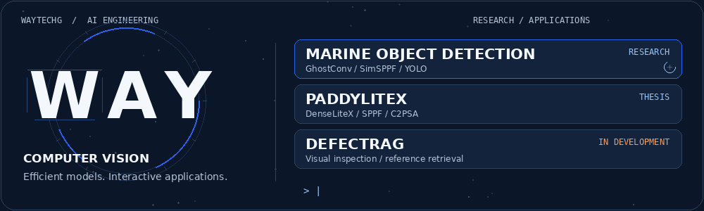

<h1 align="center">Wilbert Andrew Yonathan</h1>

  <strong>Computer Vision · Deep Learning · Efficient AI · RAG Applications</strong> 
  Fourth-year AI Engineering student at Xiamen University Malaysia

  

  
  
  
  
  

  <a href="#at-a-glance">Overview</a> ·
  <a href="#featured-projects">Projects</a> ·
  <a href="#technical-toolkit">Skills</a> ·
  <a href="#leadership">Leadership</a> ·
  <a href="#lets-connect">Contact</a>

## At a glance

| Education | Academic record | Internship availability |
| :--- | :--- | :--- |
| Fourth-year AI Engineering · XMUM | **CGPA 3.77 / 4.00** | **29 March 2027 · 3–6 months** |

I develop computer vision models and turn experiments into interactive applications. My work focuses on balancing detection quality with model size and computational cost, with reproducible comparisons behind the results.

I also explore visual defect inspection with reference retrieval and retrieval-augmented generation (RAG), connecting image analysis with relevant evidence and explanations.

**Academic recognition:** Dean’s List and XMUM Merit Scholarship for four consecutive years, **2023–2026**.

**Open to:** AI Engineering and Computer Vision internships, plus part-time or project-based collaboration, subject to availability and applicable work-authorisation requirements.

**[Visit my portfolio](https://wilbert-andrew-yonathan.vercel.app/)** for project case studies, research comparisons and interactive previews.

## Featured projects

### 01 / WAYTECHG Marine

**Underwater object detection · Lightweight architecture research**

An underwater detection project built on **DU-MobileYOLO**, exploring GhostConv and SimSPPF through model comparisons and an interactive demonstration.

- **My contribution:** Lightweight model modifications, experimental evaluation and a model-comparison interface.
- **Engineering focus:** Detection quality, parameter count and clear attribution of upstream work.
- **Tools:** Python · PyTorch · YOLO · OpenCV

[Explore the repository](https://github.com/WAYTECHG/GhostConv-and-SimSPPF-Integration-for-Marine-Organism-Detection) · [Try the live demo](https://huggingface.co/spaces/Wizzas/Marine-Object-Detection)

<strong>What to look for</strong>

The architecture changes, baseline comparisons and trade-offs between model complexity and detection performance. My contributions build on the upstream DU-MobileYOLO architecture; the original work is credited separately.

### 02 / PaddyLiteX

**Paddy disease detection · Final-year thesis**

Research into **YOLOv8n with custom DenseNet-based backbones**, including DenseLiteX, SPPF and C2PSA. The study uses baseline comparisons and ablation experiments to examine detection performance and model complexity.

- **My contribution:** Backbone development, baseline comparisons and ablation experiments.
- **Engineering focus:** Consistent dataset splits, reproducibility and transparent experimental conditions.
- **Tools:** Python · PyTorch · YOLO · OpenCV

[Explore the repository](https://github.com/WAYTECHG/PaddyLiteX-demo) · [Try the live demo](https://huggingface.co/spaces/Wizzas/PaddyLiteX)

<strong>What to look for</strong>

The backbone design, the comparison with standard YOLOv8n and DenseNet121-based baselines, and how each architecture component contributes to the final model. Accuracy and computational requirements should be read together.

### 03 / DefectRAG

**Visual defect inspection · Application in development**

An ongoing application combining visual anomaly detection with reference retrieval and retrieval-supported explanations on **MVTec LOCO AD**.

- **My contribution:** Reference-feature pipelines, anomaly-head experiments and web application integration.
- **Engineering focus:** DINOv3 features, visual reference retrieval and evidence-supported inspection explanations.
- **Tools:** Python · PyTorch · FastAPI · Docker

[Explore the repository](https://github.com/WAYTECHG/DefectRAG) · [Try the live demo](https://huggingface.co/spaces/Wizzas/defectrag-inference)

<strong>What to look for</strong>

How visual features and reference information support the inspection workflow. This project is still in development; performance evaluation and validation remain part of the ongoing work.

## Technical toolkit

| Area | Tools and project experience |
| :--- | :--- |
| **Programming** | Python |
| **Deep learning** | PyTorch · CNNs · YOLO · DenseNet · ResNet |
| **Computer vision** | OpenCV · Classification · Object detection · Visual anomaly detection |
| **Retrieval and language models** | RAG · Embeddings · Reference retrieval |
| **Applications** | Streamlit · FastAPI · Docker · Git · GitHub |
| **Evaluation** | Dataset preparation · Leakage prevention · Baseline comparisons · Ablation studies |

## Leadership

<strong>Coordination, production and community involvement</strong>

- **Head of Photography and Videography, Community Service** — Pre-production, directing, production, asset management and editing.
- **Head of General Affairs, XMUM AI Club** — Project coordination, logistics and team communication.
- **AIESEC involvement** — Committee collaboration and fundraising-event support.

## Let’s connect

Interested in an internship conversation or an AI development project?

**[View my portfolio](https://wilbert-andrew-yonathan.vercel.app/)** · **[Connect on LinkedIn](https://www.linkedin.com/in/wilbert-andrew-yonathan-85562326a/)** · **[Email me](mailto:30587wilbertandrewyonathan@gmail.com)** · **[Explore my demos](https://huggingface.co/Wizzas)**

Research interests: lightweight vision architectures · industrial visual inspection · applied machine learning · retrieval-supported AI applications

